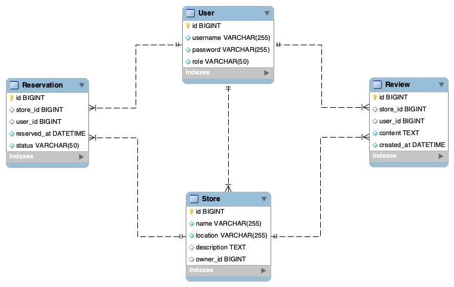

# Store Reservation System

## 🛠 프로젝트 소개
`Store Reservation System`은 사용자가 매장을 예약하고 리뷰를 남길 수 있는 웹 애플리케이션입니다. 
Spring Boot 기반으로 개발되었으며, RESTful API를 제공하여 효율적인 예약 및 리뷰 관리를 지원합니다.

---

## 📋 주요 기능
- **사용자 관리**
    - 회원가입 및 로그인
    - JWT를 사용한 인증 및 권한 관리
- **매장 관리**
    - 매장 정보 등록, 수정, 삭제
    - 매장별 리뷰 및 평균 평점 관리
- **예약 관리**
    - 매장 예약 생성, 수정, 삭제
    - 예약 도착 여부 확인
- **리뷰 관리**
    - 리뷰 등록, 수정, 삭제
    - 리뷰 평점에 기반한 매장별 평균 평점 자동 갱신

---

## 🖥 기술 스택
- **Backend**: Java 17, Spring Boot 3.4.0, JPA (Hibernate)
- **Database**: MySQL, H2 (테스트용)
- **Security**: Spring Security, JWT
- **Build Tool**: Gradle

---

## 📦 설치 및 실행

1. **프로젝트 클론**
   ```bash
   git clone https://github.com/username/store-reservation.git
   cd store-reservation
   ```

2. **필수 환경 설정**
    ```yaml
   spring:
     datasource:
      url: jdbc:mysql://localhost:3306/store
      username: store
      password: store
      driver-class-name: com.mysql.cj.jdbc.Driver
     jpa:
      hibernate:
      ddl-auto: update
   ```

3. **Docker로 MySQL 실행(선택 사항)**
    ```bash
   docker run -d \
    --name store-mysql \
    -e MYSQL_ROOT_PASSWORD=store \
    -e MYSQL_USER=store \
    -e MYSQL_PASSWORD=store \
    -e MYSQL_DATABASE=store \
    -p 3306:3306 \
    mysql:latest
   ```

4. **Gradle 빌드 및 실행**
    ```bash
    ./gradlew clean build
    ./gradlew bootRun
    ```
   
---

## 🗂 프로젝트 구조
```
    src/
    ├── main/
    │   ├── java/com/zerobase/storereservation/
    │   │   ├── config/            # 설정 관련 클래스 (SecurityConfig 포함)
    │   │   ├── controller/        # REST API 컨트롤러
    │   │   ├── dto/               # 데이터 전송 객체
    │   │   ├── entity/            # JPA 엔티티 클래스
    │   │   ├── exception/         # 커스텀 예외 처리
    │   │   ├── filter/            # 필터 클래스 (JwtAuthenticationFilter 포함)
    │   │   ├── repository/        # 데이터베이스 레포지토리
    │   │   ├── security/          # JWT 및 Spring Security 설정
    │   │   ├── service/           # 비즈니스 로직 서비스
    │   │   ├── util/              # 유틸리티 클래스
    │   └── resources/
    │       ├── application.yml    # 애플리케이션 설정

```
---

## 📌 ERD 설계
아래는 데이터베이스 엔터티 설계 다이어그램입니다.



---

## ⚙️ 주요 설정 파일

### Gradle 설정 (`build.gradle`)
```groovy
plugins {
    id 'java'
    id 'org.springframework.boot' version '3.4.0'
    id 'io.spring.dependency-management' version '1.1.6'
}

group = 'com.zerobase'
version = '0.0.1-SNAPSHOT'
sourceCompatibility = '17'

java {
    toolchain {
        languageVersion = JavaLanguageVersion.of(17)
    }
}

configurations {
    compileOnly {
        extendsFrom annotationProcessor
    }
}

repositories {
    mavenCentral()
}

dependencies {
    implementation "io.jsonwebtoken:jjwt-api:0.11.5"
    runtimeOnly 'io.jsonwebtoken:jjwt-impl:0.11.5'
    runtimeOnly 'io.jsonwebtoken:jjwt-jackson:0.11.5' // JSON 파싱 라이브러리

    implementation 'jakarta.xml.bind:jakarta.xml.bind-api:3.0.1'
    implementation 'org.glassfish.jaxb:jaxb-runtime:3.0.2'
    implementation 'org.springframework.boot:spring-boot-starter-web'
    implementation 'org.springframework.boot:spring-boot-starter-data-jpa'
    implementation 'org.springframework.boot:spring-boot-starter-security'
    implementation 'com.mysql:mysql-connector-j'
    implementation 'org.projectlombok:lombok'
    annotationProcessor 'org.projectlombok:lombok'

    testImplementation "com.h2database:h2"
    testImplementation 'org.springframework.boot:spring-boot-starter-test'
}

tasks.named('test') {
    useJUnitPlatform()
}

```


### `application.yml`
```yaml
spring:
  datasource:
    url: jdbc:mysql://localhost:3306/store
    username: store
    password: store
    driver-class-name: com.mysql.cj.jdbc.Driver
  jpa:
    hibernate:
      ddl-auto: update
    properties:
      hibernate:
        format_sql: true
      show_sql: true
```

---

## 📚 사용한 오픈 라이브러리 목록 및 사용 내용
### io.jsonwebtoken (jjwt)
```
버전: 0.11.5

사용 목적:

JSON Web Token (JWT)를 생성, 파싱, 검증하기 위해 사용.
Spring Security와 통합하여 사용자 인증 및 권한 관리를 구현.
사용 방법:

jjwt-api: JWT의 생성 및 파싱 API 제공.
jjwt-impl: JWT의 구현체로 실제 동작을 처리.
jjwt-jackson: Jackson 라이브러리를 사용하여 JSON 파싱 및 직렬화 처리.
```
```
예제:
String token = Jwts.builder()
.setSubject("user")
.signWith(secretKey)
.compact();

boolean isValid = Jwts.parserBuilder()
.setSigningKey(secretKey)
.build()
.parseClaimsJws(token)
.getBody()
.getSubject()
.equals("user");
```

### jakarta.xml.bind (JAXB)
```
버전: 3.0.1

사용 목적:

XML 및 JSON 데이터를 처리하기 위해 사용.
REST API 응답 데이터 직렬화 및 역직렬화 작업에 활용.
사용 방법:

XML이나 JSON 데이터를 DTO 객체로 매핑.
JAXB API와 Spring Boot의 통합으로 데이터를 쉽게 관리.
```

### org.springframework.boot:spring-boot-starter-web
```
버전: 3.4.0

사용 목적:

Spring Boot 기반으로 웹 애플리케이션을 구축.
REST API 엔드포인트 구현 및 HTTP 요청/응답 처리.
사용 방법:

@RestController를 사용하여 API 컨트롤러 작성.
Spring MVC 패턴을 이용한 요청 매핑 및 서비스 호출.
```

### org.springframework.boot:spring-boot-starter-data-jpa
```
버전: 3.4.0

사용 목적:

데이터베이스 연동 및 JPA를 활용한 ORM 구현.
Entity 클래스와 Repository를 사용하여 데이터 관리.
사용 방법:

@Entity로 JPA 엔티티 정의.
JpaRepository 인터페이스를 사용하여 데이터 접근 계층 구현.
```

### org.springframework.boot:spring-boot-starter-security
```
버전: 3.4.0

사용 목적:

Spring Security를 활용한 인증 및 권한 관리 구현.
JWT와 통합하여 사용자 세션 없이 보안 처리.
사용 방법:

SecurityConfig 클래스에서 Spring Security 설정.
JwtAuthenticationFilter를 통해 JWT 검증 로직 추가.
```

### com.mysql:mysql-connector-j
```
버전: 최신 (mysql:latest 이미지와 호환)

사용 목적:

MySQL 데이터베이스와의 연결 및 JDBC 작업.
사용 방법:

application.yml 파일에 MySQL 데이터베이스 설정 추가.
JPA 및 Hibernate를 통해 MySQL과 상호작용.
```

### org.projectlombok:lombok
```
버전: 1.18.36

사용 목적:

Getter, Setter, Builder, ToString 등 반복되는 코드를 줄이기 위해 사용.
사용 방법:

@Getter, @Setter, @Builder 등의 애노테이션으로 간결한 코드 작성.
```

### H2 Database
```
버전: 2.3.232

사용 목적:

테스트 환경에서 경량 데이터베이스로 활용.
개발 단계에서 데이터베이스 의존성을 줄이고 빠르게 테스트 진행.
사용 방법:

test 프로파일에서 H2를 사용하도록 설정.
JPA 및 Hibernate와 통합하여 테스트용 데이터베이스로 사용.
```